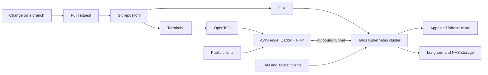

# Home-Ops

A GitOps-managed home platform built around a three-node Talos Kubernetes cluster,
a private `lab.jackhumes.com` service domain, and a small AWS edge. This directory
explains the architecture; the manifests and Terraform in the repository are the
operational source of truth.

## What runs here

| Area | Components | Purpose |
|---|---|---|
| Cluster platform | Talos, Kubernetes, Flux, Kustomize | Declarative workload delivery and reconciliation |
| Storage and networking | Longhorn, NFS, MetalLB, Traefik, CoreDNS | Persistent data, LAN access, ingress, and internal DNS |
| Identity and access | Pocket ID, Tiny Auth, Headscale | OIDC, protected applications, and private tailnet access |
| Home services | Home Assistant, MQTT, Pi-hole, Immich | Home automation, DNS, and personal services |
| Media automation | Jellyfin, *arr services, qBittorrent, SABnzbd | Media serving, discovery, and download automation |
| Observability | Prometheus, Grafana, Loki, Alloy, CrowdSec | Metrics, logs, dashboards, and request protection |
| Public edge | AWS Lightsail, Caddy, FRP | TLS and tightly scoped public access without opening home ports |

## Architecture at a glance



### Traffic boundaries

- **Internal services** use `*.lab.jackhumes.com` and enter through Traefik on
  the LAN or tailnet.
- **Public services** use `*.jackhumes.com`. Caddy terminates TLS on the AWS
  edge, then forwards only declared hosts through FRP to the cluster.
- **Home routers never need application port-forwards.** The in-cluster FRP
  client establishes the connection to the edge.
- **Data stays local where practical.** Longhorn holds application state; NFS
  provides shared NAS-backed media and download storage.

## Repository map

| Path | Contents |
|---|---|
| [`apps/`](../apps/) | Plain Kubernetes manifests, grouped by application |
| [`infrastructure/`](../infrastructure/) | Cluster-wide services such as ingress, storage, TLS, and DNS |
| [`flux/`](../flux/) | Flux entrypoint, component Kustomizations, and Helm sources/releases |
| [`charts/`](../charts/) | Wrapper charts for the small set of upstream Helm dependencies |
| [`talos/`](../talos/) | SOPS-encrypted Talos machine configuration |
| [`terraform/`](../terraform/) | OpenTofu for the AWS edge, edge DNS, and Grafana resources |
| [`scripts/`](../scripts/) | Flux manifest validation and HelmRelease adoption helpers |
| [`Justfile`](../Justfile) | Routine Talos, Flux, and maintenance commands |

Applications are normally plain manifests with one `kustomization.yaml` per
directory. Helm is deliberately limited to upstream dependencies that need it.
Flux discovers the component tree from [`flux/cluster/`](../flux/cluster/).

## Making a change safely

1. Create a branch and worktree; changes reach the cluster through a pull
   request, never by committing directly to `main`.
2. Keep application resources together in `apps/<app>/`, give every hand-written
   resource an explicit namespace, and add it to that directory's
   `kustomization.yaml`.
3. Add or update the corresponding Flux component before expecting a manifest to
   reconcile.
4. Seal credentials and tokens. Public URLs, ports, and ordinary feature flags
   belong in ConfigMaps; private values do not.
5. Validate the complete Flux graph before opening the pull request.

```bash
# Show the available maintenance commands.
just help

# Build every component referenced by the Flux entrypoint and check layout rules.
just flux-validate

# Also compare the rendered manifests to a reachable cluster.
just flux-diff

# Inspect Talos node health.
just talos-status
```

`just flux-diff` and the Talos commands require working cluster credentials.
Validation uses `kubectl` and `yq`; see the validation script for its exact
checks.

## Secret handling

Never commit a plaintext password, token, private key, or credential-bearing
connection string.

- Use a **SealedSecret** for application credentials under `apps/`.
- Use **SOPS with age** for Talos files under `talos/`.
- Keep Terraform credentials as sensitive variables in Terrakube, not in `.tf`
  files or local state.
- Treat regenerated secrets as rotations: update every consumer in the same
  change.

## Operational model

Flux reconciles the Kubernetes side from Git. Terrakube plans pull requests and
applies OpenTofu after changes merge to `main`. The edge is exceptional: its
launch script describes a fresh instance, but a live edge service change must
also be rolled out over SSH because Terraform intentionally ignores `user_data`
updates on the existing Lightsail instance.

This split keeps routine cluster changes declarative while preserving deliberate,
reviewable control of the internet-facing edge.

## Architecture notes

| Document | Read when you need to understand |
|---|---|
| [Network topology](network-topology.md) | The relationship between clients, the edge, cluster ingress, DNS, and storage |
| [GitOps flow](gitops-flow.md) | Flux reconciliation, Helm boundaries, and edge provisioning |
| [Public access](public-access.md) | TLS termination and FRP request flow for public services |
| [Tailnet VPN](tailnet-vpn.md) | Headscale connectivity, direct paths, and relay fallback |
| [Media streaming](media-streaming.md) | Local and remote media paths plus bandwidth considerations |

The detailed diagrams intentionally use example names and addresses. For current
component names, domains, and deployment contracts, inspect the manifests and
the repository guide.