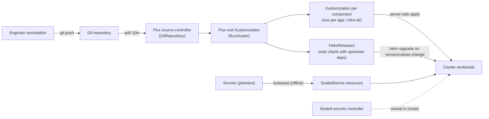
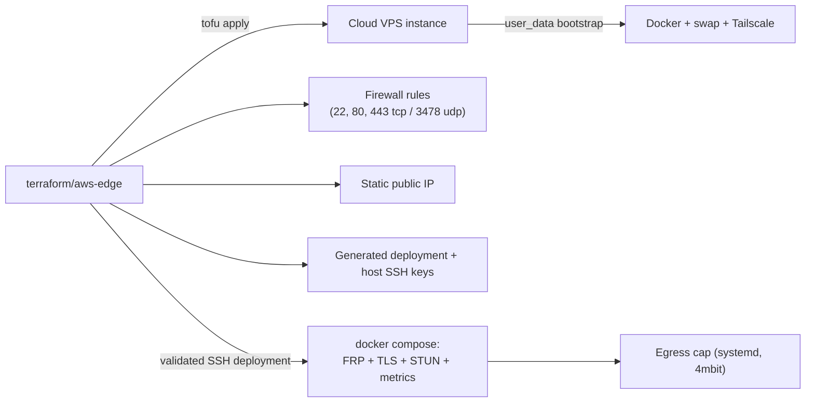
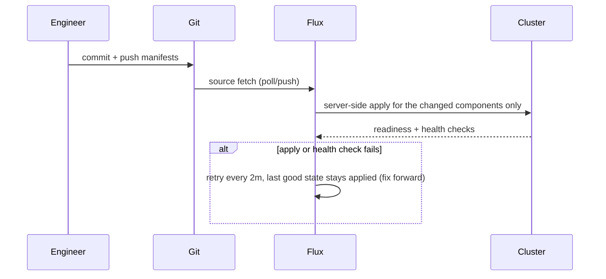

# GitOps Flow

Everything is declared in Git. Nothing is hand-built on servers.

## Cluster side (Flux)

- Each app directory is plain YAML plus a `kustomization.yaml`, applied by its own
  Flux `Kustomization`. A commit therefore only mutates the components whose files
  changed; every other component reconciles as a no-op server-side apply. App
  configuration lives in ConfigMaps; credentials only ever exist as SealedSecrets.
- Only charts with a real upstream dependency stay `HelmRelease`s (`apps/immich`,
  `apps/pihole`, `apps/podinfo`, `charts/cert-manager`, `infrastructure/longhorn`,
  plus `radar` from the skyhook repo). They use `reconcileStrategy: ChartVersion`,
  so they re-render only when `Chart.yaml` `version` or `spec.values` changes -
  an unrelated commit can no longer re-upgrade storage or TLS.
- Single-replica stateful apps use `strategy: Recreate` (RWO volumes deadlock
  a RollingUpdate when the replacement schedules on another node).
- Config that must restart its workload is fed through a kustomize
  `configMapGenerator` (glance, headscale): the name hash changes, so the pods roll.
- There is no automatic rollback for Kustomization-managed components - a bad
  manifest stays applied and is fixed forward. Only the six HelmReleases keep
  Helm's remediation/rollback behaviour.

## Edge VM side (Terraform)

- `user_data` bootstraps a replacement VM from the same files used for live
  configuration, but stays ignored by lifecycle to prevent accidental replacement.
- `terraform_data.edge_config` hashes, validates, and deploys service files over
  SSH whenever they change, then recreates the Compose services.
- Terraform-generated SSH private keys remain in sensitive Terrakube state;
  additional unlabeled operator public keys are versioned configuration.
- Other secrets are sensitive Terrakube workspace variables, never committed.
- DNS records are the one manual island (managed DNS console).

## Change flow

