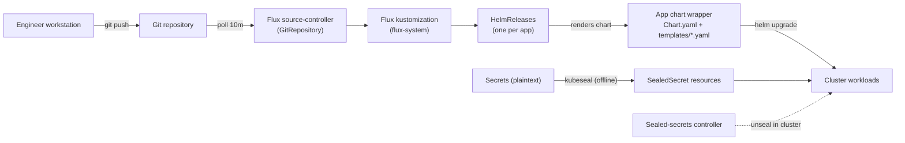
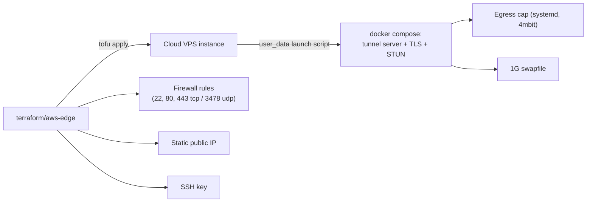
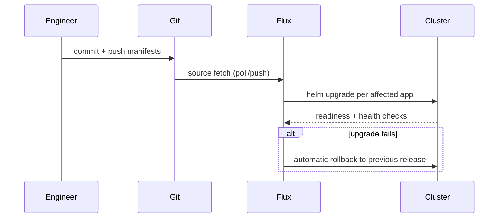

# GitOps Flow

Everything is declared in Git. Nothing is hand-built on servers.

## Cluster side (Flux)

- Each app directory is a minimal chart: plain YAML manifests packaged by a
  glob template. App configuration lives in ConfigMaps; credentials only ever
  exist as SealedSecrets.
- Single-replica stateful apps use `strategy: Recreate` (RWO volumes deadlock
  a RollingUpdate when the replacement schedules on another node).
- Helm upgrade timeouts are raised (15m) so slow first-time image pulls do not
  trip remediation rollbacks.

## Edge VM side (Terraform)

- The launch script is idempotent and lives in Git: a destroyed/replaced VM
  converges to the same state.
- Secrets (tunnel token) are injected at apply time via environment variables,
  never committed.
- DNS records are the one manual island (managed DNS console).

## Change flow

