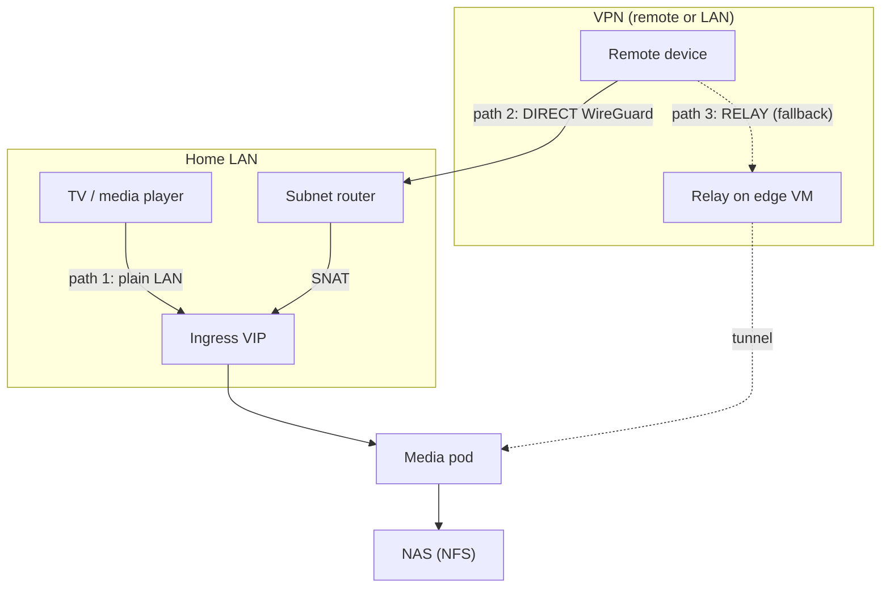
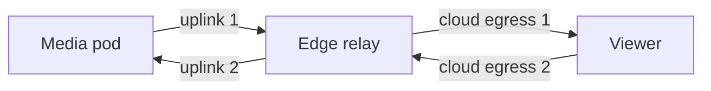
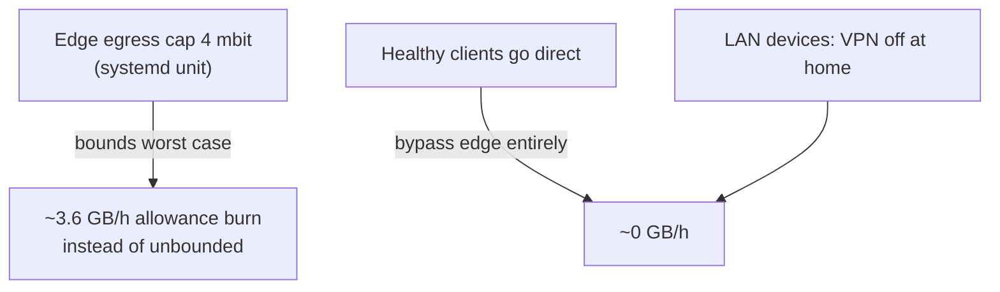

# Media Streaming

The media app runs in the cluster; media files live on a NAS over NFS. How a
viewer reaches it determines whether cloud bandwidth is consumed.

## The three paths

| Path | Who | Cloud bytes |
|---|---|---|
| 1. Plain LAN | Devices at home with VPN off | **Zero** — TV → ingress → pod → NAS |
| 2. Direct WireGuard | Remote devices with a healthy client | **Zero** — peer-to-peer; edge only did control-plane work |
| 3. Relayed | Devices whose client cannot form direct paths | **High** — every byte crosses the edge twice (in + out) |

## Why path 3 is dangerous for budget

A relayed stream consumes the transfer allowance **twice** (the media enters
the edge from the cluster, then leaves to the viewer). At a typical ~14 Mbit
stream that is ~12.6 GB of allowance per hour of viewing.

## Guardrails

## Practical rules

1. At home, keep the VPN **off** on fixed devices (TV): the LAN path is faster
   and free.
2. On the road, use the VPN with an updated client app; verify the connection
   shows **direct**, not relayed.
3. If a device must relay, expect the edge egress cap to slow it — that is the
   budget guard doing its job.
4. Acceptance check for any device: its peer entry should show a direct
   address (LAN or public), never a relay with growing byte counters.
