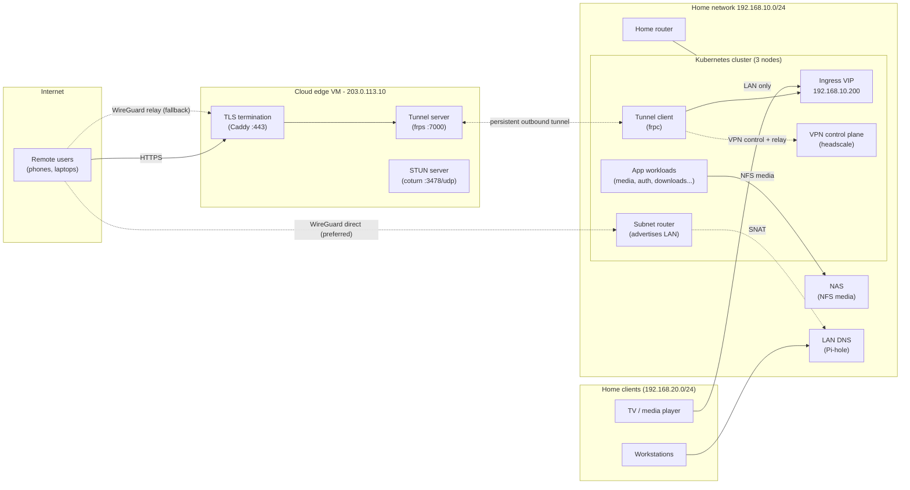
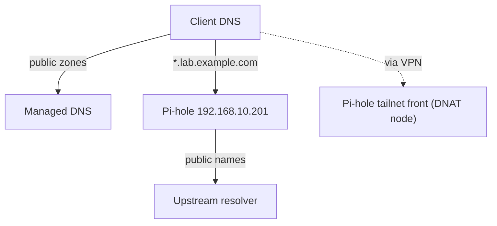

# Network Topology

## Global view

## Traffic classes

| Class | Path | Touches edge VM? |
|---|---|---|
| Public web (auth, dashboard) | Internet → edge Caddy → tunnel → ingress → app | Yes (small) |
| VPN control + endpoint discovery | Client → edge (HTTPS + STUN) → VPN control | Yes (tiny) |
| VPN **direct** peer stream | Client ↔ peer (WireGuard, internet or LAN) | **No** |
| VPN **relayed** stream (fallback) | Client → edge relay → tunnel → peer | Yes (large — this is the guarded path) |
| Home LAN media (TV) | TV → ingress → media pod → NAS | **No** |

## DNS

- Public service names resolve to the **edge VM IP**.
- Internal `*.lab.example.com` names resolve to the **ingress VIP**, served by
  Pi-hole so both LAN and VPN clients get the same answers.
