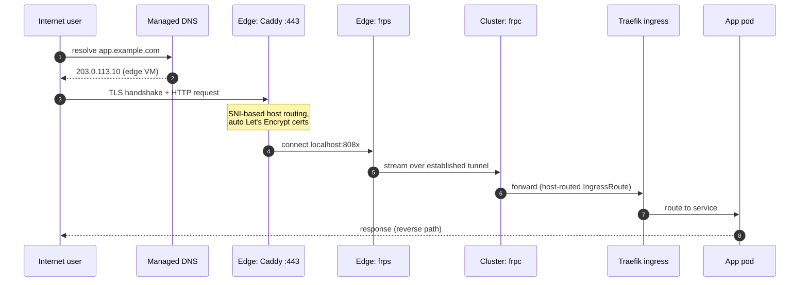
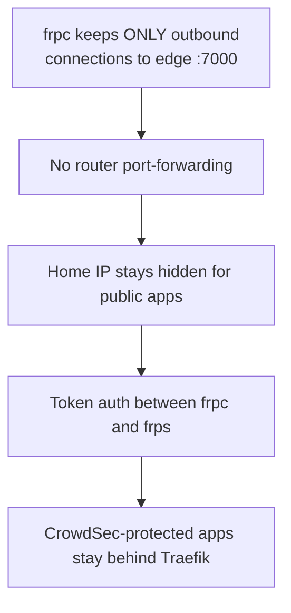

# Public Access (Tunnel + TLS)

Public services are exposed **without any inbound ports at home**. A client in
the cluster keeps a persistent outbound connection to the edge VM; public
traffic rides that tunnel.

## Request path

## Proxies

| Public name | Edge port | Backend |
|---|---|---|
| `auth.example.com` | 8081 (via Caddy) | Traefik :80 → auth app |
| `vpn.example.com` | 8082 (via Caddy) | VPN control plane :8080 (direct, not via Traefik) |
| `tracker.example.com` | 8083 (via Caddy) | Traefik :80 → tracker app |

## Key properties

- frpc targets the ingress (Traefik) for most apps so bot-protection
  middleware still applies; the VPN control plane is forwarded directly.
- TLS certificates are issued on the edge by Caddy (HTTP-01 via ports 80/443).
- Only one frpc instance may claim a proxy name at a time; restarting two
  clients concurrently causes a benign "proxy already exists" race that
  resolves on frp's retry cycle.
