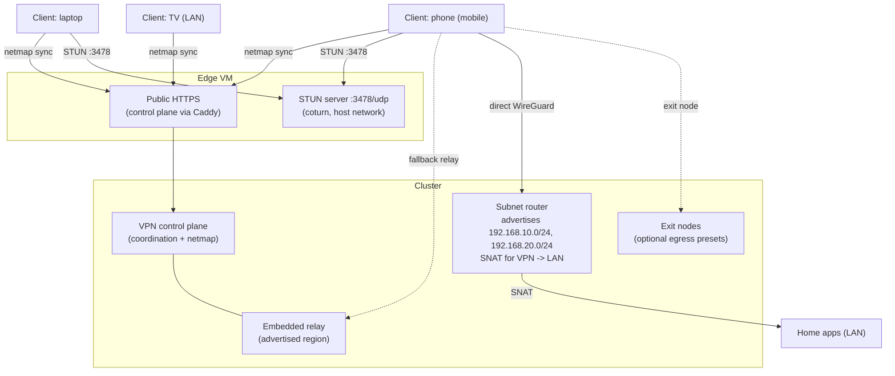
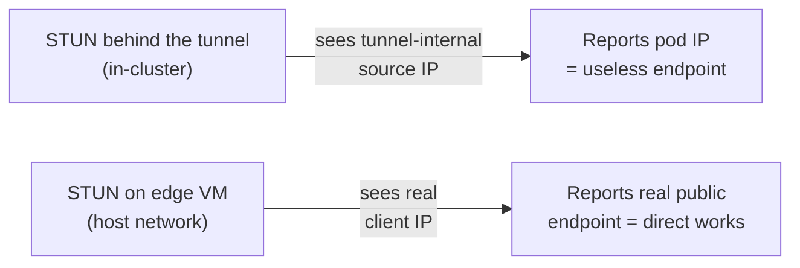
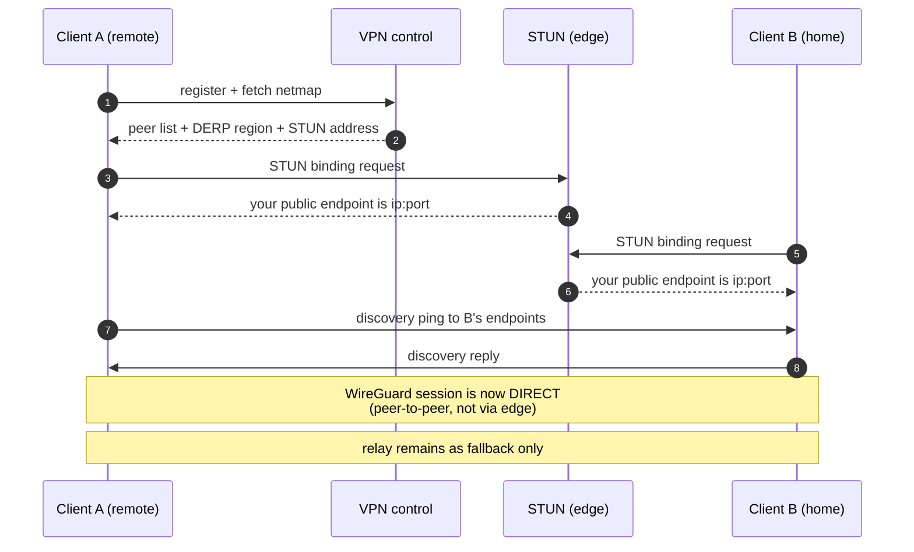

# Tailnet VPN

Self-hosted VPN coordination (headscale-compatible control plane) runs in the
cluster. Devices join from anywhere and should talk to each other **directly**;
the relay is only a bootstrap and fallback.

## Components

## Why STUN runs on the edge VM

STUN must answer with the client's IP **as the internet sees it**.

- A STUN server placed behind the tunnel reports the tunnel client's internal
  pod address as the caller's public endpoint; peers then try to connect to an
  unroutable address and stay on the relay.
- The relay socket inside the VPN control pod is also known-bad in this
  version (binds but never answers); it keeps port 3478 bound, so the working
  STUN server lives on the edge where nothing competes for the port.

## How a direct path forms

## DNS endpoint: avoid pod egress NAT

Headscale sends DNS queries to `pihole-dns` (`100.64.0.2`), which DNATs them to
Pi-hole's LAN VIP (`10.0.0.201`). The DNS Tailscale daemon uses `hostNetwork` on
`talos-tug-zp7` and a fixed UDP/41642 socket; the subnet router uses
`hostNetwork` on `talos-lox-1n1` and UDP/41641. They cannot share a host network
namespace: both daemons manage `tailscale0` and netfilter rules. Keep the DNS
node's Longhorn state volume when moving it so its tailnet IP stays stable.

A regular Flannel pod is not a usable direct DNS endpoint here: outbound UDP
passes through `MASQUERADE --random-fully`, so STUN advertises the translated
port while Kubernetes `hostPort` forwards the untranslated port. STUN working
does **not** prove the advertised endpoint can receive peer traffic. Do not
replace `hostNetwork` with `hostPort` for the DNS daemon.

Verify both paths with `tailscale ping 100.64.0.2` and
`tailscale ping 100.64.0.14`, then time
`dig glance.lab.jackhumes.com @100.64.0.2` and load
`https://glance.lab.jackhumes.com`. A direct ping shows a peer IP:port;
`DERP(headscale)` means traffic goes through the bandwidth-capped edge.

## Health checks that matter

| Symptom | Meaning |
|---|---|
| `UDP: true` + public IPv4 in netcheck | Endpoint discovery works |
| `pong ... via <peer-ip>:port` | **Direct** path (desired) |
| `pong ... via DERP(relay)` | Relaying — every byte bills against edge transfer |
| Peer advertises no endpoints | Broken/limited client app; fix or update it |

## Guardrails

- Edge egress is capped (4 mbit) so a relayed/broken client cannot exhaust the
  data-transfer allowance.
- Devices that refuse direct paths should stay off the VPN or be updated;
  on-LAN devices do not need the VPN at home at all.
